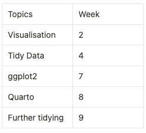

**Week 9**

Question 1: I chose to work on speed dating to find out the least disireable attribute in a partner.

Question 2: I have gathered data sets from Kaggle on the different attributes and other factors that affects love from blossoming. 

**Week 10**

Question 3: The Singapore Dating Scene 

Question 4: According to an article by TodayOnline, we are in the " slowest decade of population growth since 1970". Based on another article by TodayOnline, the lack of confidence plays a big part as "It’s usually those who are quiet, socially awkward... they don't know how to make themselves attractive and it slowly snowballs", as shared by an interviewee. In addition to Zula's recent article, "Survey Shows 81% Of Singaporeans Prefer To Date Someone Kind, Physical Attributes Not As Important", it mentions that "81% of the respondents also mentioned that being kind is more important than physical attributes" and this motivates to me further pick out important attributes to help single and lost individuals see if they are on the right track. 

Question 5: 


1. Matches (to narrow down to successful cases)
2. Age (see which age range has more succes cases)
3. attr ,sinc ,intel ,fun ,amb ,shar (different attributes)
4. Gender (Visualise Male vs Female data sets)

I think the data set is quite big as there were many stages to the survey and it gets a little overwhelming cleaning the data as there are many filters and I think it would be the hardest part. To make things easier, I made sure to know what I want to get from the data set, like a flow chart so I can filter out the data step by step.

**Week 11**

Question 1: 
I think the I would make a graph or slider to separate the male and female data. The visualisations will be to compare the different attributes that have proven to be successful as well as field of work. It breaks teh bigger question down to the various factors and the specific data. It allows one to see the ranking of their top attribute.

Question 2: 
I plan to not just use the dataset but also allow users to try answering some questions so as to compare their ranking with the existing dataset. I will further explore the different ggplots and  see how i can better improve the interactions along the way.

(3) What concepts incorporated in your project were taught in the course and which ones were self-learnt? (Answer: Create a table with topics in one column and Weeks in the other to indicate which concept taught in which week is being used. Leave the entry of the Week column empty for self-learnt concepts)

```{r eval=TRUE, echo=TRUE}

```
I think one of the bigger challenges I faced was with having too much data and not being able to decide on what to show for the visualisation and that leads to me not being able to properly clean and tidy my data. I also felt that I should have more datasets so that i can cross reference and make sure that my hypothesis is truly supported.I think planning is the biggest challenge now and once I am set on what i want to do, I think it will be alright. I think writing all these down and planning on paper will help make this easier, not just the content but also the layout of the webpage.